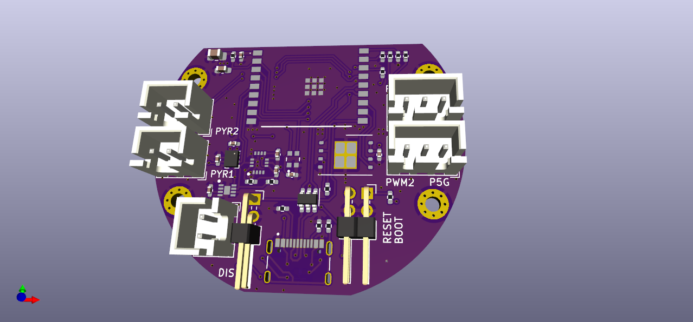
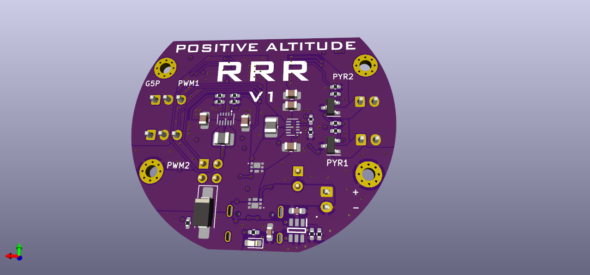

# RRR
This repo contains design files for experimental "RRR" flight computer for Trust Vector Control model rockets. The main idea is to use an ESP32-C3 microcontroller (RISC V) and Rust programming language. So the name is Risc Rust Rocket.
Please keep in mind that this is a prototype an proof of conceps, so expect issues and design mistakes. All parts was sources from LCSC, so you can find LCSC part numbers populated for every component.

### Know issues
- Inertia measurement unit Pin 12 (CSB) is wrongly connected to GND. It should be connected to VCC or floating. It is possible to fix this by carefully cutting two traces with a sharp knife under a microscope.
- Pyro channels transistors placed incorrectly. That could be fixed if you solder them rotated 120 degrees counter-clockwise. Looks quite ugly but possible.